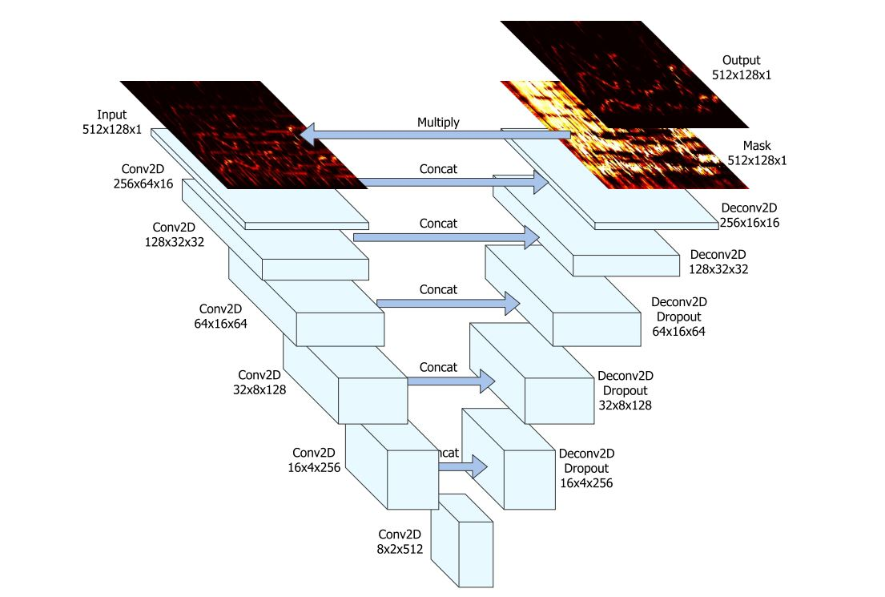

# Spleeter  - Pytorch Implementation

This repository houses a from-scratch pytorch implementation of `Spleeter` - for details see the [original repo](https://github.com/deezer/spleeter), and [paper](https://archives.ismir.net/ismir2019/latebreaking/000036.pdf).

The goal of the network is to predict the vocal and instrumental components of an input song provided as an audio spectrogram. Each stem is extracted by a separate UNet architecture similar to a convolutional autoencoder using strided convolutions and extra skip-connections.



## Quickstart

```bash
# Clone the repo
git clone https://github.com/dcyoung/pt-spleeter.git
cd pt-spleeter

# Build the docker image
docker build -t pt-spleeter:latest .
```

## Split Songs (Inference)

Leveraging official pretrained weights from Spleeter - see [here](https://github.com/deezer/spleeter/wiki/3.-Models). Conversion of the weights from tensorflow to pytorch is supported here.

```bash
# Download and extract the pretrained model to ./models directory
wget https://github.com/deezer/spleeter/releases/download/v1.4.0/2stems.tar.gz -O /tmp/2stems.tar.gz
mkdir -p ./models/2stems
tar -xf /tmp/2stems.tar.gz -C ./models/2stems

# Extract isolated vocals and accompaniment tracks from a song
docker run -it --rm \
    -v $(pwd):/pt-spleeter \
    -t pt-spleeter:latest \
    python /pt-spleeter/run.py split \
        --input=/pt-spleeter/path/to/song.mp3 \
        --model-path=/pt-spleeter/models/2stems/model \
        --output-dir=/pt-spleeter/output
```

## Training

WIP...

```bash
# Download data
python -c 'import musdb; musdb.DB(download=True, root="data/musdb18")'

# Convert to wav
musdbconvert data/musdb18 data/musdb18-wav

# Check it worked... should print 94
python -c 'print(len(musdb.DB(root="data/musdb18-wav", is_wav=True,subsets=["train"])))'
# -> 94

# Run training...
docker run -it --rm \
    -v $(pwd):/pt-spleeter \
    -t pt-spleeter:latest \
    python /pt-spleeter/train.py \
    --output-dir=/pt-spleeter/experiments \
    --dataset=/pt-spleeter/data/musdb18-wav
```

## References

- Audio spectrogram handling largely lifted from [spleeter-pytorch](https://github.com/tuan3w/spleeter-pytorch)